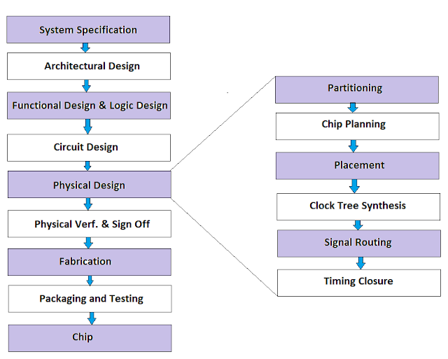
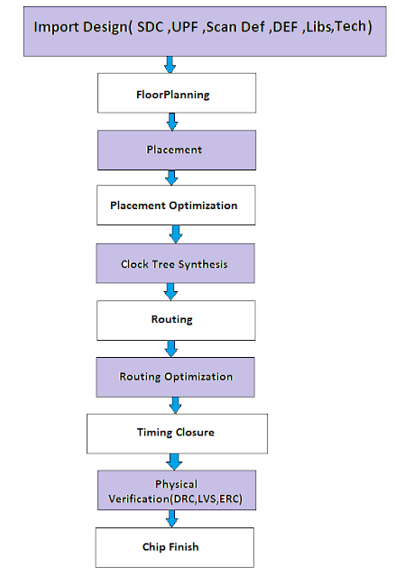

# Digital VLSI SoC Design and planning Training
## Overview
This repository contains my work on System-on-Chip (SoC) design, following the methodologies used in the NASSCOM VSD SoC Design Program.

## Tools Used
- Verilog for RTL design.

- OpenROAD for physical design.

- Magic for layout.

- Sky130 PDK.

## Workflow
- RTL Design.

- Synthesis.

- Floorplanning.

- Placement & Routing.

- GDSII Generation.

## Physical Design Flow
   In the RTL to GDS flow, physical design plays a crucial role. During this stage, the synthesized netlist, design constraints, and standard cell library are used as inputs to generate a layout (GDS file), adhering to the design rules specified by the foundry. This layout is then sent to the foundry for chip fabrication. The entire process of converting a gate-level netlist into a layout is referred to as physical design.

   Physical design consists of multiple stages, each with its own mandatory checks, analyses, and verifications. Here is a detailed information.
   
   

## Import Design or NetlistIn
The first step in the physical design flow is the Import Design or NetlistIn phase. Here, all relevant design files and constraint files are imported, including the netlist, SDC (Synopsys Design Constraints), UPF (Unified Power Format), DEF (Design Exchange Format), technology files, logical and physical libraries, and TLU+ files.

## Floorplanning or Chip Planning
Floorplanning is a crucial stage in the physical design process. At this point, the netlist, which describes the design and its various blocks along with their interconnections, is utilized. While the netlist provides a logical representation of the ASIC design, floorplanning translates this into a physical layout. This involves mapping the logical description to the physical description by placing blocks or macros within the chip or core area. Key tasks in this phase include:

Determining the width and height of the core and die.
Identifying the locations of predefined cells/macros.
Planning the placement of I/O pins.
Creating the pad ring for the chip.
The main objectives of floorplanning are to minimize both area and delay.

## Placement
Placement involves arranging the standard cells within the design. During this stage, the tool determines the optimal location for each standard cell on the die using internal algorithms. Placement is not merely about positioning the cells from the synthesized netlist; it also involves design optimization and assessing the routability of the layout. Various criteria can drive placement decisions, including timing, congestion, and power optimization. The goals of placement include:

Optimizing area, timing, and power.
Minimizing timing DRCs (Design Rule Checks) and cell/pin density.
Ensuring that the placement is routable.
## Clock Tree Synthesis (CTS)
Clock Tree Synthesis (CTS) ensures that clock signals are uniformly distributed to all sequential elements within the design. This process involves inserting buffers or inverters along the clock paths to minimize skew. The objectives of CTS are to satisfy clock tree design rule constraints—such as maximum transition, maximum load capacitance, and maximum fanout—while achieving targets like minimal skew and insertion delay.

## Routing
Routing occurs after CTS and determines the precise paths for interconnections within the layout. This process connects various blocks in the chip. With information from the placed cells, blockages, clock tree buffers/inverters, and I/O pins available post-CTS, the routing tool can finalize all connections specified in the netlist. The routing stage employs metal and vias to establish the electrical connections defined by the logical relationships in the netlist. The main objectives of routing include:

Meeting timing constraints.
Avoiding LVS (Layout vs. Schematic) errors.
Ensuring no DRC errors exist.
Minimizing total wire length.
Routing consists of several stages:
a) Global Routing
b) Track Assignment
c) Detailed Routing
d) Search and Repair

## Physical Verification and Signoff
After routing, the layout is prepared for the Physical Verification and Signoff stage. Here, various signoff checks are performed, including physical verification, timing analysis, and logical equivalence checking. Key physical verification checks include:

Layout vs. Schematic (LVS): This compares the layout with the schematic to confirm functional matching. A clean LVS report indicates that they match.
Design Rule Check (DRC): This verifies that the layout adheres to the design rules established by the fabrication team, assessing spacing rules between metals, minimum width rules, via rules, and more.
Electrical Rule Check (ERC) and Antenna Check: Additional checks to ensure electrical integrity.
The equivalence check compares the pre-layout/synthesis netlist with the post-layout netlist generated by the tool after place and route (PnR) to ensure functional consistency.

## DAY 1
 ### Task - To run Openlane flow using 'picorv32a' design and calculate the flop ratio.
  To run the Openlane flow with the picorv32a design and calculate the flop ratio, follow these steps:
  1. Change the directory to Openlane
  2. Create an alias for running Docker
  3. Invoke OpenLane in interactive mode
  4.  Write the Package require

``` 
     cd Desktop/work/tools/openlane_working_dir/openlane
     docker
     ./flow.tcl -interactive
     package require openlane 0.9 
     
```
Now run synthesis using following command


`
 run_synthesis
`


 Calculate the flop ratio

 Flop ratio= Number of D Flip flops/ Total number of cells

 percentage of DFF's = flop ratio x 100

 Here 
 Number of DFF is 1613
 and total number of cells is 14876.
 My flop ratio is 10.842


## Day 2
### Good floorplan VS Bad floorplan and Introduction to library cells 

#### Chip Floorplanning Considerations:

#### Utilization Factor and Aspect Ratio
To determine the utilization factor and aspect ratio in chip design, we first need to understand how the height and width of the core and die areas are defined.

Core Area: The section of the chip where all logic cells and components are placed. This is the functional area of the chip where logic operations occur.

Die Area: The outer region surrounding the core, primarily used for placing input/output (I/O) related components.
The core's height and width are defined by the netlist, which determines the number of components needed to implement the logic. The die's dimensions depend on those of the core.

For instance, consider a netlist with two logic gates and two flip-flops, each occupying 1 square unit. The total area required for the core is 4 square units.

*Utilization Factor:*
This is defined as the ratio of the area occupied by the netlist to the total core area. A good floorplan ensures that the utilization factor is less than 1, leaving room for any additional logic that may be required later.

`Utilization Factor = (Area occupied by netlist / Total core area)`
​
 
*Aspect Ratio:*
The aspect ratio is the ratio of the core’s height to its width. If the aspect ratio is 1, the core is square-shaped; otherwise, it will be rectangular.

`Aspect Ratio = (Height of the core / Width of the core)`
​
### Task-1 
#### Run 'picorv32a' Design Floorplan Using OpenLANE.
Steps for running floorplan
1. Open the terminal and navigate to the directory where the design is saved.
2. Run the command ` run_floorplan` to generate the floorplan.
3. The floorplan will be saved in the `floorplan` directory.
4. Open the floorplan in the Magic tool to visualize the design.

### Task-2
#### Calculate Die area in microns
```Die area = (Die width x Die height)```
```math
Die\ width\ in\ microns = \frac{550064}{1000} = 550.064\ Microns
```
```math
Die\ height\ in\ microns = \frac{567120}{1000} = 567.120\ Microns
```
```math
Area\ of\ die\ in\ microns = 550.064 * 567.120 = 311952.29568\ Square\ Microns
```


### Task-3
#### Load the floorplan in Magic tool
Use the following command to launch MAGIC with the required technology file, LEF, and DEF:
```
cd Desktop/work/tools/openlane_working_dir/openlane/designs/picorv32a/runs/28-09_14-14/results/floorplan/
```
```
magic -T /home/vsduser/Desktop/work/tools/openlane_working_dir/pdks/sky130A/libs.tech/magic/sky130A.tech lef read ../../tmp/merged.lef def read picorv32a.floorplan.def &

```


 Once the MAGIC GUI opens, you should see the floorplan layout displayed in the tool.

We can now use the visualization tools in MAGIC (zoom, center, select cells, etc.) to inspect and analyze the floorplan.

- Center the design: Press `S` to select the entire design and `V` to align it vertically on the screen.

- Zoom in: Left-click and drag to select a specific area, then press `Z` to zoom in on that region.


### Task-4
#### Run placement and run plcement def in magic tool
#### Placement in VLSI Design
Placement involves deciding where to physically place standard cells (logic elements) within a chip. Placement can be broken down into two stages:

*Global Placement:* This assigns rough locations to cells, allowing some overlap. The goal is to create an initial layout that adheres to area constraints.

*Detailed Placement:* This refines the locations, ensuring there is no overlap and that cells are placed on legal sites, which directly impacts the routing stage.
Use the following comamand to run the placement
```
run_placement
```


Use the following command to run the placement def in magic tool

1. Navigate to the Directory
```
cd Desktop/work/tools/openlane_working_dir/openlane/designs/picorv32a/runs/28-09_14-14/results/placement/

```
2. Load the Placement DEF File in MAGIC
```
magic -T /home/vsduser/Desktop/work/tools/openlane_working_dir/pdks/sky130A/libs.tech/magic/sky130A.tech \
lef read ../../tmp/merged.lef def read picorv32a.placement.def &

```


#### Inputs and Outputs in the Design Process
- Process Design Kits (PDKs): Technology-specific information for chip design.
- Design Rule Check (DRC) and Layout vs. Schematic (LVS) Rules: Ensure compliance with layout and functional requirements.
- SPICE Models: Used for circuit simulation.
- Library & Custom Specifications: Specific design libraries and user-defined parameters.

Outputs:

- CDL (Circuit Description Language): A text-based representation of the circuit.
- GDSII: The layout file for fabrication.
- LEF (Library Exchange Format): Contains cell size, pin location, and other details.
- SPICE Netlist: Extracted parasitic information for circuit simulation.
- Timing, Noise, and Power Libraries: Generated during characterization.

## Day 3


